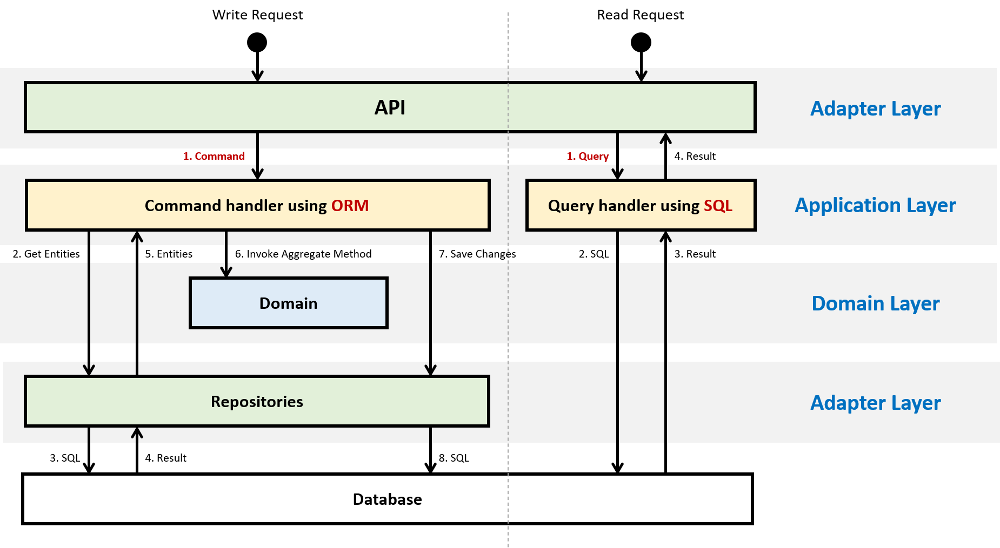
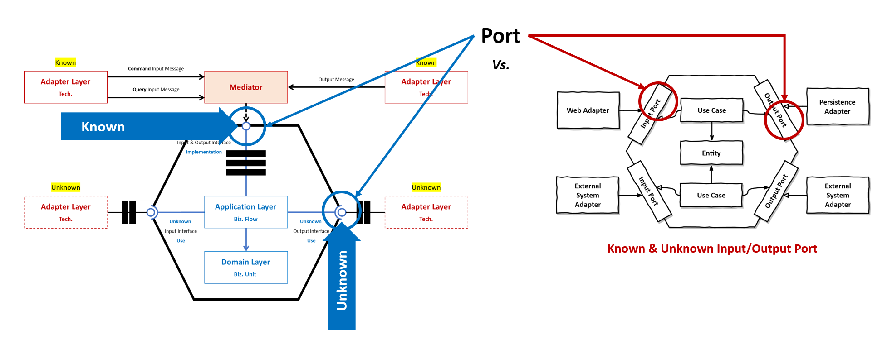
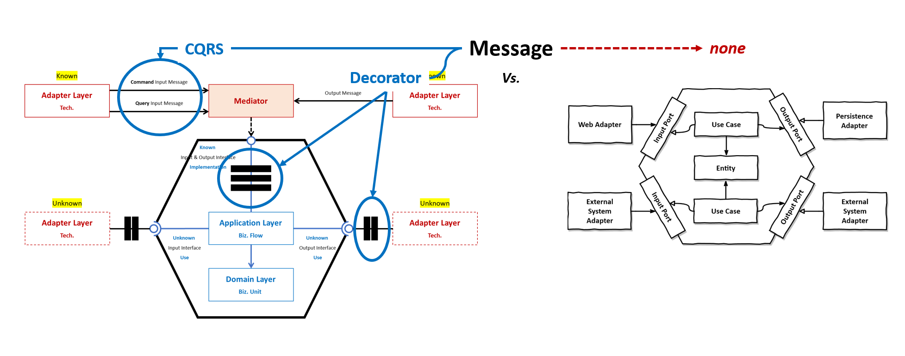
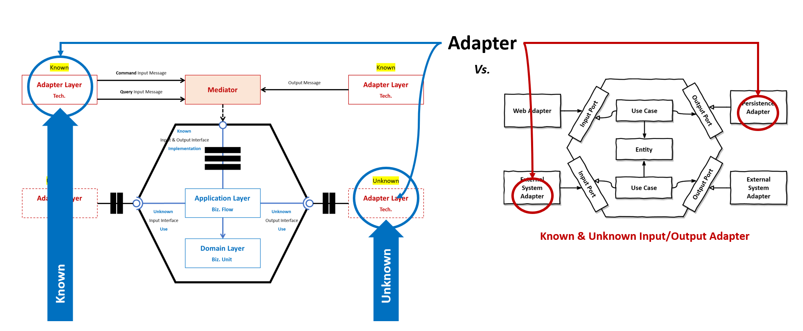
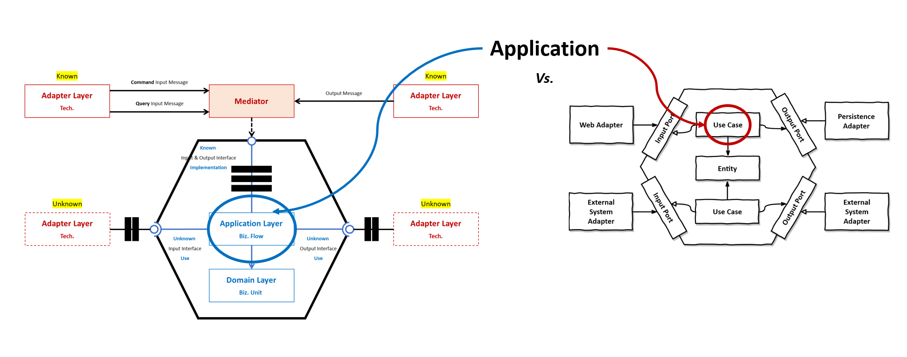
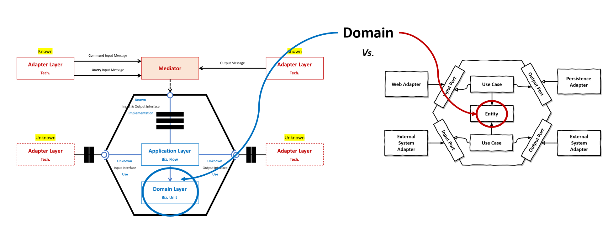

# Internal 아키텍처

## Internal 아키텍처 구성도


- Internal 아키텍처는 시스템을 구성하는 **레이어별로** 책임, 역할, 그리고 협력을 명확히 정의하고 구조화합니다. 이를 통해 각 레이어가 독립적으로 동작하면서도 유기적으로 협력할 수 있는 기반을 마련합니다.
- **유스케이스(Application 레이어: 비즈니스 흐름)가 모든 레이어를 주관합니다.**

### 특징
- 도메인인 용어
- CQRS 성능(불필요한 DTO 최소화)
- Adapter 레이어 인터페이스 Pipeline 코드 생성기
- 비즈니스 관찰 가능성
  - 레이어별 에러 코드
  - Application 레이어 유스케이스 단위
  - Adapter 레이어 인터페이스 단위

## Internal 아키텍처 메시지


- 입력 메시지를 데이터 수정 유/무로 Command과 Query로 분리합니다.
  - Command일 때는 ORM을, Query일 때는 SQL을 사용합니다.
  - Query의 경우 ORM 대신 SQL을 사용함으로써 불필요한 DTO 사용을 줄일 수 있고, 여러 테이블을 참조해야 하는 복잡한 SQL Query를 DB 담당자와 더 효율적으로 소통하고 관리할 수 있습니다.

## Internal 아키텍처 트릴레마(trilemma)
> 세 가지 선택지나 목표 중에서 오직 두 가지만 만족할 수 있고, 나머지 하나는 포기해야 하는 상황을 가리킵니다.  
> 즉, 세 가지 조건이나 목표를 동시에 달성할 수 없는 딜레마의 확장판이라 볼 수 있습니다.


### 예제 코드 1.


- “결정을 내리는 코드”와 “해당 결정에 따라 적용하는 코드”을 **분리합니다.**
  - 순수 함수: 결정을 내리는 코드
  - 불순 함수: 해당 결정에 따라 적용하는 코드

### 예제 코드 2.
- [기본 코드](https://github.com/AcornPublishing/unit-ing/blob/main/Book/Chapter6/Listing7_/Before/ArchitectureBefore.cs)
- [개선 1. 의존성 주입 코드](https://github.com/AcornPublishing/unit-ing/blob/main/Book/Chapter6/Listing7_/Mocks/ArchitectureMocks.cs)
- [개선 2. 순수성 코드](https://github.com/AcornPublishing/unit-ing/blob/main/Book/Chapter6/Listing7_/Functional/ArchitectureFunctional.cs)

```cs
public class AuditManager
{
  private readonly int _maxEntriesPerFile;
  private readonly string _directoryName;

  public AuditManager(int maxEntriesPerFile, string directoryName)
  {
    _maxEntriesPerFile = maxEntriesPerFile;
    _directoryName = directoryName;
  }

  public void AddRecord(string visitorName, DateTime timeOfVisit)
  {
    string[] filePaths = Directory.GetFiles(_directoryName);
    (int index, string path)[] sorted = SortByIndex(filePaths);

    string newRecord = visitorName + ';' + timeOfVisit.ToString("s");

    if (sorted.Length == 0)
    {
      string newFile = Path.Combine(_directoryName, "audit_1.txt");

      // 메서드 시그니처에 정의 안된 숨겨진 출력: 숨겨진 의존성
      File.WriteAllText(newFile, newRecord);
      return;
    }

    (int currentFileIndex, string currentFilePath) = sorted.Last();
    List<string> lines = File.ReadAllLines(currentFilePath).ToList();

    if (lines.Count < _maxEntriesPerFile)
    {
      lines.Add(newRecord);
      string newContent = string.Join("\r\n", lines);

      // 메서드 시그니처에 정의 안된 숨겨진 출력: 숨겨진 의존성
      File.WriteAllText(currentFilePath, newContent);
    }
    else
    {
      int newIndex = currentFileIndex + 1;
      string newName = $"audit_{newIndex}.txt";
      string newFile = Path.Combine(_directoryName, newName);

      // 메서드 시그니처에 정의 안된 숨겨진 출력: 숨겨진 의존성
      File.WriteAllText(newFile, newRecord);
    }
  }
```


## Internal 아키텍처 비교

### Port 비교


| 구분                | 아키텍처        | 헥사고날 아키텍처 |
| ---                 | ---           | ---               |
| Known 입출력 Port   | Mediator 패턴  | Strategy 패턴      |
| Unknown 입출력 Port | Strategy 패턴  | Strategy 패턴      |

- 헥사고날 아키텍처에서는 Known과 Unknown 외부 입출력을 명시적으로 구분하지 않지만, 우리는 이를 구분하여 Port를 정의합니다.
  - Known 입출력은 Mediator 패턴을 활용하여 메시지 기반으로 처리합니다.
  - Unknown 입출력은 Strategy 패턴을 사용하여 인터페이스를 통해 처리합니다.

### Message 비교


- 데이터 쓰기를 위한 메시지(Command)와 데이터를 읽기 위한 메시지(Query)로 구분합니다.
- 모든 메시지를 대상으로 부가 기능을 Decorator로 추가합니다.

### Adapter 비교


- Known과 Unknown 외부 입출력을 명시적으로 구분하여 Adapter 위치를 배치합니다.
  - Known 입출력은 Mediator 패턴을 활용하여 메시지 발신과 수신을 구현합니다.
  - Unknown 입출력은 Strategy 패턴을 사용하여 인터페이스을 구현합니다.

### Application 비교


- Application은 동일하게 모두 DDD 전술 설계 패턴에서 제시하는 Application Service 중심으로 구현됩니다.

### Domain 비교


- Domain은 동일하게 모두 DDD 전술 설계 패턴에서 제시하는 Entity와 Value Object 그리고 Domain Service을 중심으로 구현됩니다.


## 솔루션 구성
 Level  | Src              | Tests
------- |-------------     |--------------
 `T1`   | Corporation      | Corporation
 `T2`   | Solution         | Solution
 `T3`   | Service 또는 UI  | Service 또는 UI
 `T4`   | **Layers**       | **Tests**
 `T5`   | **Sub-Layers**   | **Test Pyramid**

- Layers
  - `T4` Domain
  - `T4` Application
  - `T4`: Adapters
    - `T5` Infrastructure
    - `T5` Persistence
    - `T5` Presentation
- Test Pyramid
  - `T4` Tests
    - `T5` Unit
    - `T5` Integration
    - `T5` Performance
    - `T5` E2E(End to End)

```
{T2}.sln
  │ # 부수 목표
  ├─Abstractions
  │   ├─Frameworks
  │   │   ├─Src
  │   │   │   ├─{T1}.{T2}.Framework
  │   │   │   └─{T1}.{T2}.Framework.Contracts
  │   │   └─Tests
  │   │       └─{T1}.{T2}.Framework.Tests.Unit
  │   └─Libraries
  │       ├─{T1}.{T2}.[Tech]                                    // 예. RabbitMQ, ...
  │       └─...
  │
  │ # 주요 목표: Backend
  ├─Backends
  │   ├─{T3}
  │   │   ├─Src
  │   │   │   ├─{T1}.{T2}.{T3}                                  // Host 프로젝트
  │   │   │   ├─{T1}.{T2}.{T3}.Adapters.Infrastructure          // Adapter 레이어
  │   │   │   ├─{T1}.{T2}.{T3}.Adapters.Persistence             // Adapter 레이어
  │   │   │   ├─{T1}.{T2}.{T3}.Application                      // Application 레이어
  │   │   │   └─{T1}.{T2}.{T3}.Domain                           // Domain 레이어
  │   │   └─Tests
  │   │       ├─{T1}.{T2}.{T3}.Tests.Integration                // Integration 테스트
  │   │       ├─{T1}.{T2}.{T3}.Tests.Performance                // Performance 테스트
  │   │       └─{T1}.{T2}.{T3}.Tests.Unit                       // Unit Test
  │   ├─{T3}
  │   │   ├─Src
  │   │   └─Tests
  │   └─Tests
  │       └─{T1}.{T2}.Tests.E2E                                 // End to End 테스트
  │
  │ # 주요 목표: Frontend
  └─Frontends
      └─{T3}
          ├─Src
          │   ├─{T1}.{T2}.{T3}                                  // Host 프로젝트
          │   ├─{T1}.{T2}.{T3}.Adapters.Infrastructure          // Adapter 레이어
          │   ├─{T1}.{T2}.{T3}.Adapters.Persistence             // Adapter 레이어
          │   ├─{T1}.{T2}.{T3}.Application                      // Application 레이어
          │   └─{T1}.{T2}.{T3}.Domain                           // Domain 레이어
          └─Tests
              ├─{T1}.{T2}.{T3}.Tests.Integration                // Integration 테스트
              ├─{T1}.{T2}.{T3}.Tests.Performance                // Performance 테스트
              └─{T1}.{T2}.{T3}.Tests.Unit                       // Unit Test
```

```powershell
.\new-sln -t1 Corp -t2 Hello -t3s Master, Api
```
- `T1`: Corporation
- `T2`: Solution
- `T3`:
  - Backend Service App.
  - Frontend UI App.

### 프로젝트 의존성 다이어그램


## 레이어별 주요 목표
> 주요 목표를 달성하기 위한 모든 부가 활동은 `Abstractions` 폴더에 관련 코드를 배치 시킵니다.

구분               | 목표   | 레이어
---                | ---   | ---
비즈니스 주요 목표  | 유한   | Domain 레이어(비즈니스 단위), Application 레이어(비즈니스 흐름)
기술 주요 목표      | 무한   | Adapter 레이어

- 비즈니스 주요 목표: 유한
  - 비즈니스 단위(Domain 레이어): Aggregate Root
  - 비즈니스 흐름(Application 레이어어): Use Case
- 기술 주요 목표: 무한

### 레이어 예제
```shell
#
# 비즈니스 단위: Domain 레이어
#
Corp.Hello.Api.Domain
  ├─Abstractions          // 부가 코드: 의존성, ...
  │   ├─...
  │   └─Registrations     // 의존성 등록
  │
  └─AggregateRoots        // 주요 코드: 비즈니스 단위, 유한
      ├─...

#
# 비즈니스 흐름: Application 레이어
#
Corp.Hello.Api.Application
  ├─Abstractions          // 부가 코드: 의존성, ...
  │   ├─...
  │   └─Registrations     // 의존성 등록
  │
  └─UseCases              // 주요 코드: 비즈니스 흐름, 유한
      ├─...

#
# 기술: Adapter 레이어
#
Corp.Hello.Api.Adapters.Infrastructure
  ├─Abstractions          // 부가 코드: 의존성, ...
  │   ├─...
  │   └─Registrations     // 의존성 등록
  │
  ├─...                   // 주요 코드: 기술, 무한
  │   ├─...
  └─...                   // 주요 코드: 기술, 무한
      ├─...

```

## Q&A
- Internal 아키텍처를 주관하는 레이어는?  
  ※ 주관 (主管, 어떤 일의 주가 되어 그 일을 책임지고 맡아 관리함)