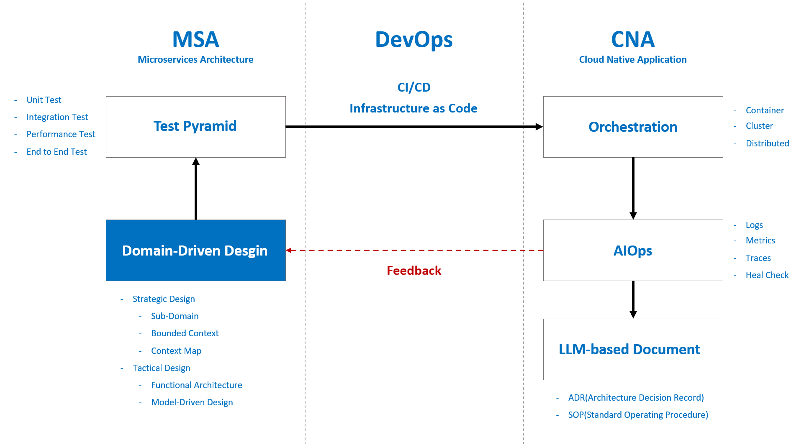

# 아키텍처

> wise code that works = `VOC` |> `DDD` |> `Architecture`  
> 동작하는 지혜로운 코드를 만들기 위한 아름다운 여정

- **소스 코드 구조는** 책의 목차처럼 명확하게 도메인과 시스템을 쉽게 이해할 수 있어야 합니다.
- **테스트 코드는** 비즈니스 규칙을 이해하기 위한 매뉴얼 역할을 해야 합니다.

## Application 아키텍처

### 아키텍처 기술 맵

### Internal 아키텍처 (Hexagonal Architecture)

### External 아키텍처
> TODO

## 분리
### 관심사의 분리
- 기술 관심사: 기술 레이어(Adapter Layer)
- 비즈니스 흐름 관심사: 애플리케이션 레이어(Application Layer)
- 비즈니스 단위 관심사: 도메인 레이어(Domain Layer)

### 목표의 분리
- 주요 목표
- 부수 목표: 주요 목표를 달성하는 과정에서 자연스럽게 함께 수행되거나 보조 역할을 하는 목표를 의미합니다.
  - 레이어의 주요 목표와 부수 목표를 직관적으로 이해할 수 있도록, 부수 목표는 Abstractions 폴더 안에 배치하고 최상위에는 주요 목표만 남도록 구성합니다.
  - 이를 통해 주요 목표와 부수 목표를 쉽게 구분하고 명확하게 이해할 수 있습니다.

## 레이어
### 기술 레이어(인프라스트럭처, 프리젠테이션)
- 정의: 기술적인 구현 세부 사항을 처리하는 레이어입니다.
- 구성 요소
  - **`기술 레이어 = 기술 로직 ∪ 기술 코드`**
    - 기술 로직 (예: 로깅, 보안, 유틸리티)
    - 기술 코드 (예: 데이터베이스 연결, 메시지 큐, 외부 API 호출)
- 역할
  - 기술적인 요구 사항을 충족합니다.
  - 인프라스트럭처와의 상호 작용을 처리합니다.
  - 영속성과 관련된 기술적인 구현을 담당합니다.

### 애플리케이션 레이어
- 정의: 유스케이스를 실행하고, 트랜잭션을 관리하며, 도메인 레이어와 기술 레이어를 연결하는 레이어입니다.
- 구성 요소
  - **`애플리케이션 레이어 = 애플리케이션 로직`**
    - 애플리케이션 로직 (유스케이스 실행, 트랜잭션 관리)
- 역할
  - 사용자의 요구사항에 맞는 애플리케이션 흐름을 제어하고 관리합니다.
  - 도메인 레이어와 기술 레이어의 상호 작용을 조율합니다.
  - 도메인 모델의 변경이 아닌 사용자의 요구사항에 맞게 흐름을 제어하고 관리하는 역할을 합니다.
- 예제
  - 주문이 완료되면 결제 프로세스를 실행한다.
  - 회원 가입 후 이메일 인증을 요청한다.

### 도메인 레이어
- 정의: 핵심 비즈니스 로직을 포함하는 레이어입니다.
- 구성 요소
  - **`도메인 레이어 = 도메인 모델 ∪ 도메인 서비스 ∪ 레포지토리 인터페이스`**
    - 도메인 모델
    - 도메인 서비스
    - 레포지토리 인터페이스
- 역할
    - 핵심 비즈니스 규칙과 로직을 캡슐화합니다.
    - 영속성 기술로부터 독립적으로 도메인 로직을 구현합니다.
- 도메인 모델
  - 정의: 도메인의 핵심 개념과 규칙을 표현하는 모델입니다.
  - 구성 요소
    - **`도메인 모델 = 도메인 로직 ∪ 도메인을 표현하는 구조적 요소들`**
      - 도메인 로직: 도메인 모델 내부에서 비즈니스 규칙, 제약 조건, 상태 변경을 처리합니다.
      - 도메인을 표현하는 구조적 요소들
        - 엔티티 (Entity)
        - 값 객체 (Value Object)
        - 도메인 이벤트 (Domain Event)
        - 애그리게이트 루트 (Aggregate Root)
  - 역할
    - 도메인 로직을 구현하고, 도메인의 상태를 관리합니다.
  - 예제
    - 예: 주문이 최소 1개 이상의 상품을 포함해야 한다.
    - 예: 할인율은 50%를 초과할 수 없다.
- 도메인 서비스
  - 정의: 특정 엔티티에 속하지 않는 복잡한 비즈니스 로직을 처리하는 서비스입니다.
  - 역할
    - 여러 애그리게이트 루트에 걸친 도메인 로직을 처리합니다.
    - 특정 엔티티나 애그리게이트 루트에 속하지 않는 비즈니스 규칙을 담당합니다.
- 레포지토리 인터페이스
  - 정의: 도메인 레이어가 영속성 기술에 의존하지 않도록 추상화하는 인터페이스입니다.
  - 역할
    - 도메인 레이어와 영속성 저장소 간의 상호 작용을 추상화합니다.
    - 도메인 레이어가 영속성 기술에 독립적으로 구현될 수 있도록 합니다.