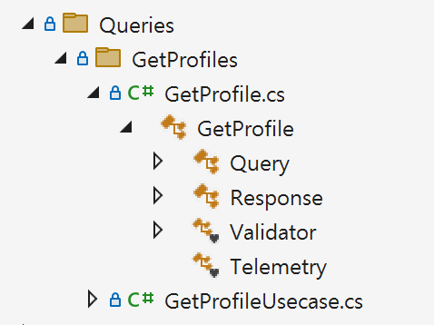

# 애플리케이션 레이어 CQRS 메시지 정의

## 개요
- CQRS 입력 메시지(`Command, Query`), 출력 메시지(`Response`), 입력 메시지에 대한 유효성 검사(`Validator`)는 서로 밀접하게 관련되어 있으므로 응집도를 높이기 위해 하나의 클래스에 Inner 클래스로 함께 정의합니다.
- 이 구조는 클래스 수를 줄이고, 입출력 메시지를 중심으로 구현의 응집도를 향상시킵니다

<br/>

## CQRS 메시지 템플릿
```cs
public static class {유스케이스 이름}

    // 입력 메시지
    public sealed record {Command | Query}(
        ...입력데이터)
        : IQuery<Response>;

    // 출력 메시지
    public sealed record Response(
        ...출력데이터)
        : IResponse;

    // 입력 유효성 감사: internal 접근 제어자(FluentValidation 패키지만 접근 허용)
    internal sealed class Validator : AbstractValidator<{Command | Query}>
    {
        public Validator()
        {
            RuleFor(_ => _.입력데이터)
                .NotEmpty();
        }
    }
}
```

<br/>

## 적용 예제



### Command 메시지 예제
```cs
// CreateAdminProfile 유스케이스
public static class CreateAdminProfile
{
    // 입력: Command
    public sealed record Command(
        Guid UserId)
        : ICommand2<Response>;

    // 출력: Response
    public sealed record Response(
        Option<Guid> AdminId)
        : IResponse;

    // 입력 유효성 검사
    internal sealed class Validator : AbstractValidator<Command>
    {
        public Validator()
        {
            RuleFor(_ => _.UserId)
                .NotEmpty();
        }
    }
}

// Command 메시지 적용
CreateAdminProfile.Command command = new(userId);
Fin<CreateAdminProfile.Response> response = await Sender.Send(command);
return response.ToResult();
```

### Query 메시지 예제
```cs
// GetProfile 유스케이스
public static class GetProfile
{
    // 입력: Query
    public sealed record Query(
        Guid UserId)
        : IQuery<Response>;

    // 출력: Response
    public sealed record Response(
        Option<Guid> AdminId,
        Option<Guid> ParticipantId,
        Option<Guid> TrainerId)
        : IResponse;

    // 입력: 윻효성 감사
    internal sealed class Validator : AbstractValidator<Query>
    {
        public Validator()
        {
            RuleFor(x => x.UserId)
                .NotEmpty();
        }
    }
}

// Query 메시지 적용
GetProfile.Query query = new(userId);
Fin<GetProfile.Response> response = await Sender.Send(query);
return response.ToResult();
```