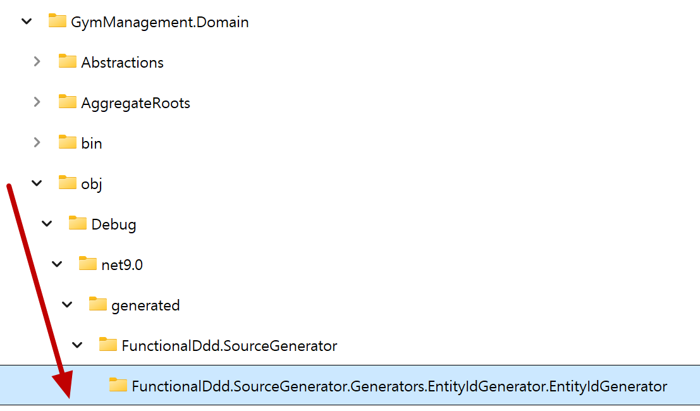

# 소스 생성기

## 개요
- C# 소스 생성기(Source Generator)는 템플릿을 기반으로 소스 코드를 컴파일 타임에 자동으로 생성하는 기능입니다.

<br/>

## 지침
- 소스 생성기는 `IIncrementalGenerator` 인터페이스를 상속받아 구현합니다.
- 소스 생성기로 생성되는 파일은 `.g.cs` 로 확장자가 붙은 파일로 `obj\generated\...`에 출력됩니다.
- 패키지화 시 `analyzers/dotnet/cs` 구조 안에 DLL이 있어야 VS/MSBuild가 자동 인식합니다.

<br/>

## 소스 생성기 개발

### 개발
```cs
// 소스 생성기 인터페이스: C# 컴파일러가 호출하는 진입점
public interface IIncrementalGenerator
{
    void Initialize(IncrementalGeneratorInitializationContext context);
}

// 1단계: 고정 코드 생성 (Post-initialization)
//  - 소스 코드 분석과 무관하게 항상 생성되는 코드 등록 (예: Attribute 정의)
//  - 컴파일 초기 단계에 한 번만 실행됨
context.RegisterPostInitializationOutput(ctx =>
    ctx.AddSource(
        hintName: {파일_이름},                                      // 생성될 파일 이름 (예: "GenerateEntityIdAttribute.g.cs")
        sourceText: SourceText.From({파일_코드}, Encoding.UTF8)));  // 파일에 포함될 코드 내용 (예: [GenerateEntityId] 특성 정의)

// 2단계: 대상 필터링 및 코드 생성 준비
//  - [GenerateEntityId] 같은 특성이 붙은 "클래스"만 대상으로 삼음
//  - 이후 코드 생성에 필요한 정보 구조로 변환
return context
    .SyntaxProvider
    .ForAttributeWithMetadataName(
        fullyQualifiedMetadataName: {Attribute_정규_이름},       // 예: "MyProject.GenerateEntityIdAttribute"
        predicate: Selectors.IsClass,                           // 클래스 선언인지 확인 (예: class Foo { })
        transform: MapToEntityIdToGenerate)                     // 클래스 → 소스 생성 입력 모델로 변환
    .Where(x => x != EntityIdToGenerateEntry.None);             // 변환 실패 or 무시할 항목은 필터링
```

### 패키징
- .nupkg 내부에서 분석기(Analyzer)로 인식시키기 위해 NuGet이 요구하는 경로에 어셈블리를 배포합니다.

```xml
<ItemGroup>
  <None Include="$(OutputPath)\$(AssemblyName).dll"
        Pack="true"
        PackagePath="analyzers/dotnet/cs"
        Visible="false" />
</ItemGroup>
```
```
YourPackage.nupkg
 ├── analyzers
 │   └── dotnet
 │       └── cs
 │           └── YourAnalyzer.dll   👈 여기 위치해야 인식됨
```

### 테스트
```cs
[Fact]
public Task EntityIdGenerator_ShouldGenerate_EntityIdAttribute()
{
  // Assert
  string input = string.Empty;

  // Act
  string? actual = _sut.Generate(input);  // TestGeneratorUtilities: 메모리에서 소스 코드 컴파일

  // Assert
  return Verify(actual);                  // 스냅샷 테스트
}

public static class TestGeneratorUtilities
{
    public static string? Generate<TGenerator>(this TGenerator generator, string sourceCode)
        where TGenerator : IIncrementalGenerator, new()
    {
        // 소스 코드에서 Syntax Tree 생성
        var syntaxTree = CSharpSyntaxTree.ParseText(sourceCode);

        // 현재 로드된 어셈블리 중 동적이 아닌 것들을 참조로 변환
        var references = AppDomain
            .CurrentDomain
            .GetAssemblies()
            .Where(assembly => !assembly.IsDynamic)
            .Select(assembly => MetadataReference.CreateFromFile(assembly.Location))
            .Cast<MetadataReference>();

        var compilation = CSharpCompilation.Create(
            "SourceGeneratorTests",     // 생성할 어셈블리 이름
            [syntaxTree],               // 소스
            references,                 // 참조
            new CSharpCompilationOptions(OutputKind.DynamicallyLinkedLibrary));

        // 컴파일: IIncrementalGenerator 소스 생성기 호출
        CSharpGeneratorDriver
            .Create(generator)
            .RunGeneratorsAndUpdateCompilation(
                compilation,
                out var outputCompilation,          // 소스 생성기 결과: 소스
                out var diagnostics);               // 소스 생성기 진단: 경고, 에러

        // 소스 생성기 진단(컴파일러 에러)
        diagnostics
            .Where(d => d.Severity == DiagnosticSeverity.Error)
            .ShouldBeEmpty();

        // 소스 생성기 결과(컴파일러 결과)
        return outputCompilation
            .SyntaxTrees
            .Skip(1)                // [0] 원본 소스 SyntaxTree 제외
            .LastOrDefault()?
            .ToString();
    }
}
```

<br/>

## 소스 생성기 사용
### 참조로 사용
```xml
<EmitCompilerGeneratedFiles>true</EmitCompilerGeneratedFiles>
<ProjectReference Include=" ... .csproj"
                  OutputItemType="Analyzer"
                  ReferenceOutputAssembly="false" />
```
- `OutputItemType="Analyzer"`을 지정하여 VS/MSBuild가 분석기로 인식할 수 있도록 합니다.
- `ReferenceOutputAssembly="true"`: 디버그 목적으로 `true`을 사용합니다.

### 패키지로 사용
- 패키지 파일을 생성합니다.
  ```shell
  dotnet pack .\Src\FunctionalDdd.SourceGenerator\FunctionalDdd.SourceGenerator.csproj `
      -c Release `
      -o ./..
  ```
- 패키지 파일을 참조할 수 있도록 저장소에 로컬 경로를 추가합니다.
  ```xml
  <?xml version="1.0" encoding="utf-8"?>

  <configuration>

    <packageSources>
      <!--To inherit the global NuGet package sources remove the <clear/> line below -->
      <clear />
      <add key="nuget" value="https://api.nuget.org/v3/index.json" />
      <add key="local" value="./Abstractions" />
    </packageSources>

  </configuration>
  ```

### 소스 생성기 결과
```
obj\Debug\net9.0\
  generated\
    {어셈블리}\
      {어셈블리}.{네임스페이스}.{IIncrementalGenerator 구현 클래스}\
        {className}.g.cs
```


```
FunctionalDdd.SourceGenerator.Generators.EntityIdGenerator.EntityIdGenerator
```
- `FunctionalDdd.SourceGenerator`: 어셈블리
- `Generators.EntityIdGenerator`: 네임스페이스
- `EntityIdGenerator`: IIncrementalGenerator 구현 클래스