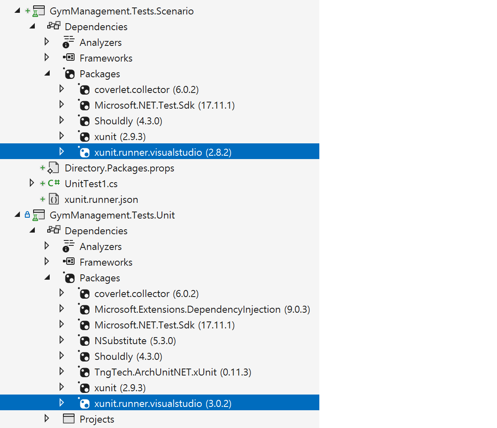

# NuGet 패키지 버전 중앙 관리

## 개요
- 기존 .NET 프로젝트에서는 각 프로젝트 파일(.csproj)마다 패키지 참조(PackageReference)와 버전(Version)을 개별적으로 관리했습니다.
- 이 방식은 프로젝트 수가 적을 때는 큰 문제가 되지 않았지만, 솔루션 내에 프로젝트가 많아질수록 다음과 같은 문제가 발생했습니다:
  - 버전 관리의 복잡성 증가: 여러 프로젝트에서 동일한 패키지를 참조하면서 서로 다른 버전을 사용하는 경우가 발생하여, 패키지 충돌이나 런타임 오류가 생길 수 있었습니다.
  - 일관성 유지의 어려움: 모든 프로젝트에서 패키지 버전을 일관되게 유지하려면, 각 프로젝트 파일을 수작업으로 수정해야 했습니다.
  - 유지보수 비용 증가: 패키지 버전을 업데이트할 때 모든 프로젝트 파일을 수정해야 하므로, 유지보수 작업이 비효율적이었습니다.
- `upgrade-assistant` 도구를 이용하여 `Directory.Package.props` 기반 패키지 관리로 업그레이드합니다.

<br/>

## 지침
- 솔루션 루트에 `Directory.Packages.props` 파일을 생성해 모든 프로젝트에서 사용하는 패키지 버전을 통합 관리합니다.
- 프로젝트별로 별도 버전이 필요한 경우, 해당 프로젝트에서 별도로 `Directory.Packages.props`를 생성하여 특정 패키지 버전을 오버라이드합니다.

<br/>

## Directory.Package.props 전환
### upgrade-assistant 도구 사용
```shell
# 도구 설치
dotnet tool install -g upgrade-assistant

# 도구 확인
dotnet tool list -g
  패키지 ID             버전            명령
  ------------------------------------------------------
  upgrade-assistant     0.5.820        upgrade-assistant

# 패키지 버전 중앙 관리: Directory.Package.props
upgrade-assistant upgrade
```


### upgrade-assistant 적용 전/후


- `upgrade-assistant` 도구를 이용하여 모든 프로젝트 파일의 `PackageReference`에서 `Version` 속성이 제거되고, 솔루션 루트에 위치한 `Directory.Package.props` 파일에 패키지 버전 정보가 명시됩니다.
- 이후 `Directory.Package.props` 파일에서 패키지 버전을 수정하면, 해당 패키지를 참조하는 모든 프로젝트에 일괄 적용되어 버전 관리를 보다 쉽게 할 수 있습니다.
- `<ManagePackageVersionsCentrally>true</ManagePackageVersionsCentrally>`
이 속성은 프로젝트들이 패키지 버전을 개별적으로 관리하지 않고, 패키지 버전을 중앙에서 관리하도록 설정합니다.
- `<PackageVersion Include="패키지_이름" Version="패키지_버전" />`은 사용할 패키지와 버전을 명시하며, 모든 하위 프로젝트에 자동 반영됩니다.

<br/>

## 프로젝트별 패키지 버전 재정의
- 중앙 관리 방식은 매우 편리하지만, 일부 프로젝트에서는 특정 패키지의 다른 버전을 사용해야 할 경우가 있습니다.



- 아래는 `xunit.runner.visualstudio`의 버전을 특정 프로젝트(GymManagement.Tests.Scenario)에서만 다르게 지정하는 예입니다.
  - GymManagement.Tests.Unit: `3.0.2`
  - GymManagement.Tests.Scenario: `2.8.2`

```xml
<Project>

  <Import Project="$([MSBuild]::GetPathOfFileAbove(Directory.Packages.props, $(MSBuildThisFileDirectory)..))" />

  <ItemGroup>
    <!-- 패키지 버전 오버라이드 -->
    <PackageVersion Update="xunit.runner.visualstudio" Version="2.8.2" />
  </ItemGroup>

</Project>
```

- `<Import ...>` 구문은 현재 위치보다 상위에 있는 `Directory.Packages.props` 파일을 자동으로 인지하지 않기 때문에 명시적으로 찾도록 지정합니다.
- `<PackageVersion Update="..." Version="..." />`는 기존에 정의된 패키지 버전을 해당 프로젝트에서만 덮어쓰는(override) 방식입니다.