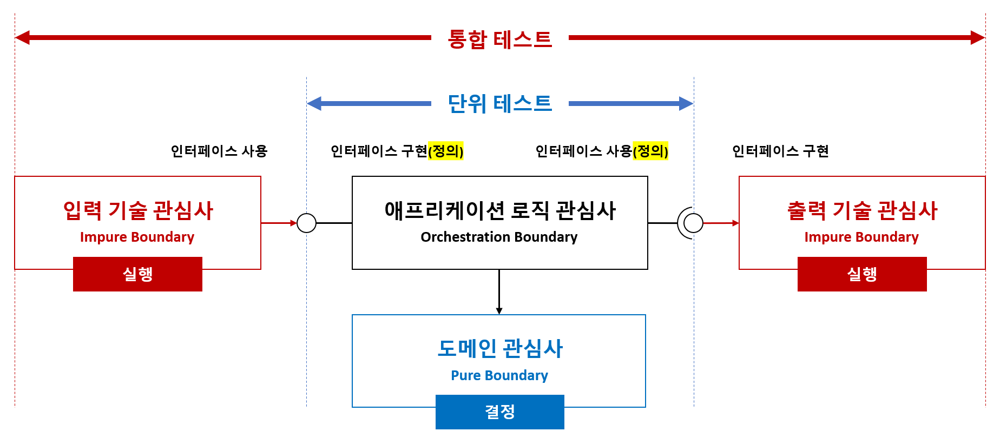

# 솔루션 테스트 자동화

## 개요
- 품질 높은 소프트웨어를 개발하고 안정적으로 유지보수하기 위해서는 자동화된 테스트 전략이 필수입니다.
- 특히, **관심사의 분리(Separation of Concerns)를** 기반으로 한 아키텍처에서는 각 레이어의 책임이 명확하므로, 테스트의 단위와 범위도 명확하게 정의할 수 있습니다.
- 도메인, 애플리케이션 로직, 기술 관심사 관점에서 다음 두 가지 테스트 전략을 설명합니다:
  - 단위 테스트 (Unit Test): 내부 로직의 정확성 검증
  - 통합 테스트 (Integration Test): 시스템 구성 요소 간 상호작용 검증

 

## 테스트

### 단위 테스트
- 도메인 모델이나 유스케이스의 내부 로직이 의도한 대로 동작하는지를 검증합니다.
- 외부 환경(파일 시스템, 데이터베이스, 메시지 브로커 등)과는 완전히 격리되어 있어야 하며, 빠르고 반복 가능한 테스트가 되어야 합니다.

### 통합 테스트
- 시스템의 여러 레이어가 실제로 연동되는 시나리오를 통해, 전체 시스템이 정상적으로 작동하는지 확인합니다.
- 실제 데이터베이스, 외부 API, 메시지 브로커 등과의 **실제 상호작용을** 포함하여 테스트를 수행합니다.

 

## 지침
- **테스트 전략은 아키텍처와 밀접하게 연관되어야 합니다.**
- 관심사 경계를 기반으로 테스트 단위를 정의하고, 단위 테스트와 통합 테스트의 **책임과 범위를 명확히 분리해야** 합니다.
- 신뢰할 수 있는 테스트 커버리지를 확보함으로써, 회귀 버그를 방지하고 리팩터링에 대한 **두려움 없이** 안정적으로 코드 개선이 가능해야 합니다.