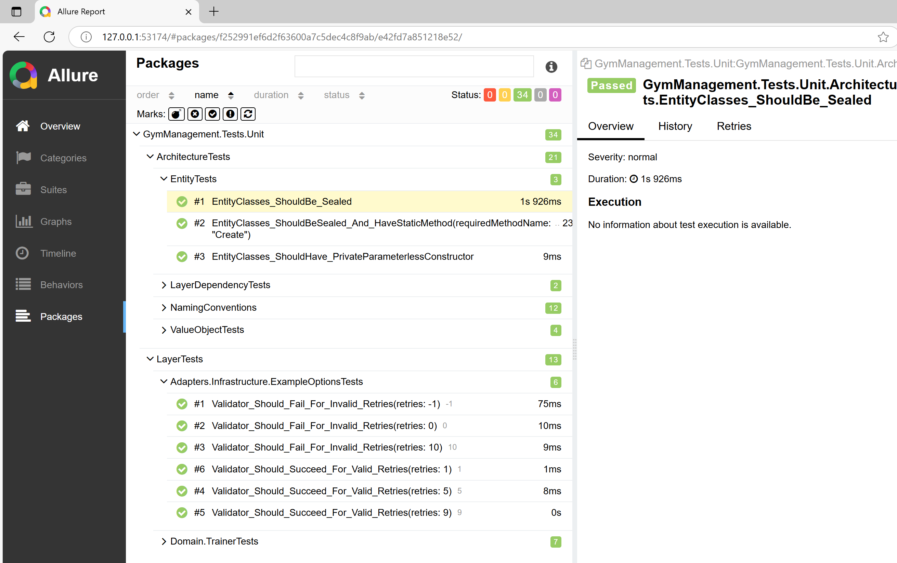

# 테스트 보고서 (Code Coverage Report, Allure Report)

## 개요
- Allure Report는 테스트 실행 결과를 시각적으로 보기 쉽게 정리해주는 리포트 도구입니다.
- .NET 프로젝트에서 xUnit, Reqnroll과 함께 사용하면 테스트 결과를 웹 기반 리포트로 확인할 수 있어 매우 유용합니다.



<br/>

## 지침
- 테스트 상황(코드 커버리지, 테스트 내용)을 웹 기반 리포트로 공유합니다.
- 테스트 프로젝트에서는 Allure 관련 NuGet 패키지를 추가하고, `allureConfig.json` 파일을 설정하여 Allure 결과 파일(.allure-results)을 생성합니다.

<br/>

## Code Coverage

### 테스트 구성 (.runsettings)
```xml
<?xml version="1.0" encoding="utf-8"?>
<RunSettings>

  <RunConfiguration>
    <ResultsDirectory>.\.coverage-results</ResultsDirectory>
  </RunConfiguration>

  <!-- Loggers -->
  <LoggerRunSettings>
    <Loggers>
      <Logger friendlyName="console" enabled="True">
        <Configuration>
            <Verbosity>quiet</Verbosity>
        </Configuration>
      </Logger>
      <!-- <Logger friendlyName="trx" enabled="True" /> -->
    </Loggers>
  </LoggerRunSettings>

  <!-- Data Collection -->
  <DataCollectionRunSettings>
    <DataCollectors>
      <DataCollector friendlyName="XPlat code coverage">
        <Configuration>
          <Format>cobertura,opencover</Format>
          <Exclude>[*.Tests?]*</Exclude>                                <!-- [Assembly-Filter]Type-Filter -->
          <ExcludeByFile>**/Migrations/*.cs,**/*.g.cs</ExcludeByFile>   <!-- Globbing filter -->
          <ExcludeByAttribute>Obsolete,GeneratedCodeAttribute,CompilerGeneratedAttribute</ExcludeByAttribute>
          <SkipAutoProps>true</SkipAutoProps>
        </Configuration>
      </DataCollector>
    </DataCollectors>
  </DataCollectionRunSettings>

</RunSettings>
```

### 테스트

```shell
dotnet test --settings .runsettings

# .coverage-results/
#   96b2a7fb-d246-4ed0-a054-d3819b5709e3/     <- 프로젝트별 GUID 생성
#     coverage.cobertura.xml
#     coverage.opencover.xml
```

- 솔루션 파일이 있는 하위 경로에 `.\.coverage-results` 폴더를 생성하여 테스트 프로젝트 단위로 코드 커버리지 결과 파일을 생성합니다.


### 코드 커버리지
```shell
reportgenerator `
  -reports:"./**/TestResults/*/*.cobertura.xml" `
  -targetdir:"./.coverage-report/" `
  -reporttypes:"Html;TextSummary;MarkdownSummaryGithub;MarkdownAssembliesSummary" `
  -verbosity:Info
```

- `./.coverage-report/` 폴더에 코드 커버리지 웹 사이트 보고서를 생성합니다.

<br/>

## Allure Report v2 설치

### Install-AllureReport.bat
```bat
@echo off
setlocal

:: Allure 버전과 설치 디렉터리 설정 (필요시 수정)
set "ALLURE_VERSION=allure-2.34.0"
set "INSTALL_DIR=C:\Workspace\Tools"

:: 현재 디렉터리 기준 PowerShell 스크립트 실행
powershell.exe -ExecutionPolicy Bypass -NoProfile -File "%~dp0Install-AllureReport.ps1" -AllureVersion "%ALLURE_VERSION%" -InstallDir "%INSTALL_DIR%"

endlocal
```
- `ALLURE_VERSION`에 설치할 allure report 버전을 명시합니다.
  - https://github.com/allure-framework/allure2/releases
  - `allure-*.zip` 최신 버전 다운로드
- `INSTALL_DIR`은 allure report을 설치할 경로입니다.

### Install-AllureReport.ps1
```powershell
param (
    [Parameter(Mandatory = $true)]
    [string]$AllureVersion,  # 예: allure-2.34.0

    [Parameter(Mandatory = $true)]
    [string]$InstallDir      # 예: C:\Workspace\Tools
)

$ErrorActionPreference = "Stop"

function Run-Step {
    param (
        [string]$StepName,
        [ScriptBlock]$Action
    )

    Write-Host "==== $StepName ====" -ForegroundColor Cyan
    & $Action
    Write-Host ""
}

# 경로 및 URL 설정
$VersionNumber = $AllureVersion.TrimStart("allure-")
$ZipUrl = "https://github.com/allure-framework/allure2/releases/download/$VersionNumber/$AllureVersion.zip"
$ZipPath = "$env:TEMP\$AllureVersion.zip"
$ExtractPath = Join-Path -Path $InstallDir -ChildPath $AllureVersion
$AllureBinPath = Join-Path -Path $ExtractPath -ChildPath "bin"

try {
    Run-Step "Downloading Allure CLI $AllureVersion" {
        Write-Host "Downloading from $ZipUrl..."
        Invoke-WebRequest -Uri $ZipUrl -OutFile $ZipPath -UseBasicParsing
    }

    Run-Step "Extracting archive to $ExtractPath" {
        Expand-Archive -Path $ZipPath -DestinationPath $InstallDir -Force
    }

    Run-Step "Updating PATH (User scope)" {
        $ExistingPath = [Environment]::GetEnvironmentVariable("PATH", "User")
        $FilteredPath = ($ExistingPath -split ";") | Where-Object { $_ -and $_ -notlike "*\allure-*\bin" }
        $NewPath = ($FilteredPath + $AllureBinPath) -join ";"
        [Environment]::SetEnvironmentVariable("PATH", $NewPath, "User")
    }

    Run-Step "Installation complete" {
        Write-Host "Allure CLI $AllureVersion installed successfully at $ExtractPath"
    }
}
catch {
    Write-Error "An error occurred during installation: $_"
    exit 1
}
```

```shell
# 버전 확인
allure --version
  2.34.0
```

<br/>

## xUnit 테스트 프로젝트 설정
### Allure.Xunt 패키지
- Allure.Xunit: `2.12.1`
  - **System.Text.Json: `9.0.4`** (Allure.Xunit 2.12.1 버전에서 System.Text.Json vulnerability 버전을 사용하고 있기 때문에 업그레이드합니다)
  - **System.Net.Http: `4.3.4`** (Allure.Xunit 2.12.1 버전에서 System.Net.Http vulnerability 버전을 사용하고 있기 때문에 업그레이드합니다)
- xunit: `2.9.3`
  - **xunit.runner.visualstudio: `2.8.2`** (.NET 9.0과 Allure.Xunit 2.12.1 버전에서는 xunit.runner.visualstudio 3.x.x 버전일 때는 정상동작하지 않습니다)

### Allure Results 생성
```json
{
  "$schema": "https://raw.githubusercontent.com/allure-framework/allure-csharp/2.10.0/Allure.XUnit/Schemas/allureConfig.hema.json",
  "allure": {
    "directory": "../../../../../../../.allure-results"
  }
}
 ```
```xml
<ItemGroup>
  <Content Include="allureConfig.json" CopyToOutputDirectory="PreserveNewest" />
</ItemGroup>
```
- `allureConfig.json` 파일을 통해 테스트 실행 시 생성되는 Allure 파일의 저장 위치를 `.allure-results` 폴더로 설정합니다.

## 솔루션 설정

### .runsettings-allurereport
```xml
<?xml version="1.0" encoding="utf-8"?>
<RunSettings>
  <RunConfiguration>
    <ReporterSwitch>allure</ReporterSwitch>
  </RunConfiguration>
</RunSettings>
```

- `.runsettings` 파일을 이용하여 reporter을 `xunit.runner.visualstudio`에서 `allure`으로 변경합니다.
  - .runsettings-allurereport 대신 `dotnet test -- RunConfiguration.ReporterSwitch=allure` 명령으로 대체할 수 있습니다.
  - https://xunit.net/docs/runsettings#ReporterSwitch

### Allure Report 생성

```shell
# Allure Report 생성
allure generate .\.allure-results\ --clean -o .\.allure-report

# Allure Report 웹사이트 열기
allure open .\.allure-report
```

<br/>

## 테스트 보고서 생성

### .gitignore
```.gitignore
.allure-results/
.allure-report/

.coverage-results/
.coverage-report/
```

### 테스트 스크립트
```powershell
# -OpenAllure:$false
# -OpenCoverage:$false

param (
  [bool]$OpenCoverage = $true,
  [bool]$OpenAllure = $true
)

# ---------------------------------------------------
# 폴더 구성
# ---------------------------------------------------
# ./.coverage-results     : 코드 커버리지 결과
# ./.coverage-report      : 코드 커버리지 웹사이트 보고서
#
# ./.allure-results   : allure 테스트 결과
# ./.allure-report    : allure 테스트 웹사이트 보고서

# 오류 발생 시 즉시 중단
# https://learn.microsoft.com/ko-kr/powershell/module/microsoft.powershell.core/about/about_preference_variables?view=powershell-7.5#erroractionpreference
$ErrorActionPreference = "Stop"

function Run-Step {
  param (
    [string]$StepName,
    [ScriptBlock]$Action
  )

  Write-Host "==== $StepName ====" -ForegroundColor Cyan
  & $Action
  Write-Host ""
}

# 솔루션 복원 및 빌드
Run-Step "🔧 Restore and Build Solution" {
  dotnet restore
  dotnet build -c Release
}

# Allure history 복사
Run-Step "📁 Copy Allure History (if exists)" {
  $previousHistory = ".\.allure-report\history"
  $newResultDir = ".\.allure-results\"

  if (Test-Path $previousHistory) {
    Write-Host "➡ 복사 중: $previousHistory → $newResultDir"
    Copy-Item -Path $previousHistory -Destination $newResultDir -Recurse -Force
  }
  else {
    Write-Host "⚠ 이전 history 디렉토리가 존재하지 않습니다. 생략합니다."
  }
}

# 테스트 실행
Run-Step "🧪 Run Tests with Code Coverage" {
  dotnet test `
    --configuration Release `
    --no-build `
    --verbosity q `
    --settings .runsettings
}

# 코드 커버리지 리포트 생성 (reportgenerator 사용)
Run-Step "📊 Generate Code Coverage Report" {
  reportgenerator `
    -reports:"./**/TestResults/*/*.cobertura.xml" `
    -targetdir:"./.coverage-report/" `
    -reporttypes:"Html;TextSummary;MarkdownSummaryGithub;MarkdownAssembliesSummary" `
    -verbosity:Info
}

# Allure 리포트 생성
Run-Step "📈 Generate Allure Report" {
  allure generate .\.allure-results\ --clean -o .\.allure-report\
}

# 옵션: 코드 커버리지 리포트 열기
if ($OpenCoverage) {
  Run-Step "🌐 Open Code Coverage Report in Browser" {
    $coveragePath = Resolve-Path ".\.coverage-report\index.html"

    # 커버리지 리포트 경로 출력
    Write-Host "커버리지 리포트 경로: $coveragePath" -ForegroundColor Green

    Start-Process $coveragePath
  }
}

# 옵션: Allure 리포트 열기
if ($OpenAllure) {
  Run-Step "🌐 Open Allure Report in Browser" {
    $reportPath = Resolve-Path ".\.allure-report\"

    # 경로 출력
    Write-Host "📂 Allure Report Path: $reportPath" -ForegroundColor Green

    # Allure 리포트를 브라우저에서 열기
    allure open $reportPath
  }
}
```